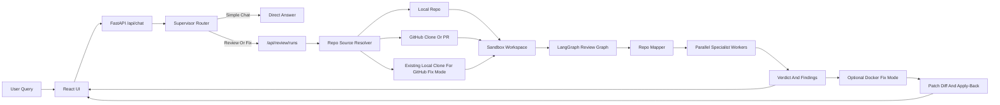

# Agent Swarms Repo Review

## Abstract

Agent Swarms Repo Review is a local-first repository review assistant built with FastAPI, LangGraph, React, and sandboxed tool execution.

The project demonstrates two core ideas:

- An agent-swarm architecture where a supervisor routes work to the right specialist sub-agents.
- Sandbox VM style execution where agents inspect repositories through controlled shell and Python tools instead of touching the source repo directly.

It supports simple supervisor chat, local repository review, GitHub repository review, and Docker-backed fix mode for guarded README/code/text edits.

## Key Features And Architecture

### Key Features

- **Dynamic supervisor routing**: Simple messages are answered directly. Repository tasks are routed into the review swarm.
- **Agent swarms**: The supervisor selects only the workers needed for the query, such as repo mapper, static reviewer, runtime tester, security reviewer, docs/devex reviewer, or dependency validator.
- **Parallel review workers**: Specialist agents run through a LangGraph workflow and collect evidence with deterministic sandbox tools.
- **Sandbox VM integration**: Repositories are copied into an isolated per-run workspace before tools execute.
- **Local and GitHub review**: The backend can review a local path, clone a GitHub repository, or check out a GitHub pull request head.
- **Fix mode with Docker**: Fix mode uses a Docker sandbox, generates a patch, validates supported edits, and applies approved changes back to the local repo.
- **Live UI**: The React UI streams supervisor decisions, worker status, command logs, mapper stats, findings, and patch diffs.

### Architecture



## Requirements

Backend:

- Python 3.12 or newer
- `pip`
- Git
- Docker Desktop, required for Fix mode and recommended for sandbox demos
- NVIDIA NIM API key, optional but recommended for LLM-powered supervisor and sub-agent messages

Frontend:

- Node.js 18 or newer
- npm

Notes:

- The default `mock` LLM backend works without an API key, but responses are deterministic and less intelligent.
- The `local` sandbox backend is useful for development, but Docker is the stronger demo path for sandboxed execution.
- Never commit `.env` or real API keys. Use `.env.example` as the public template.

## Setup

Clone the project:

```bash
git clone https://github.com/Honam0905/AI-Projects.git
cd AI-Projects/Repo-review
```

Create the backend environment:

```bash
python3 -m venv .venv
source .venv/bin/activate
pip install -r requirements.txt
```

Create a backend `.env` file in the project root:

```bash
AGENT_SWARMS_APP_NAME=Agent Swarms API
AGENT_SWARMS_APP_ENV=development
AGENT_SWARMS_APP_HOST=127.0.0.1
AGENT_SWARMS_APP_PORT=8000
AGENT_SWARMS_API_PREFIX=/api
AGENT_SWARMS_LOG_LEVEL=INFO
AGENT_SWARMS_LLM_BACKEND=nvidia
AGENT_SWARMS_NVIDIA_API_KEY=your_key_here
AGENT_SWARMS_SANDBOX_BACKEND=local
AGENT_SWARMS_SANDBOX_DATA_DIR=.agent_swarms_data
AGENT_SWARMS_SANDBOX_EXEC_TIMEOUT_SECONDS=120
AGENT_SWARMS_SANDBOX_PYTHON_EXECUTABLE=python3
AGENT_SWARMS_DOCKER_SANDBOX_IMAGE=agent-swarms-sandbox:latest
AGENT_SWARMS_DOCKER_SANDBOX_CONTAINER_PREFIX=agent-swarms
AGENT_SWARMS_DEFAULT_REVIEW_REPO_PATH=/absolute/path/to/default/repo
AGENT_SWARMS_REPO_CACHE_DIR=
AGENT_SWARMS_REPO_CLONE_TIMEOUT_SECONDS=120
AGENT_SWARMS_LOCAL_CLONE_SEARCH_ROOTS=/absolute/path/to/folder/that/contains/cloned/repos
AGENT_SWARMS_LOCAL_SANDBOX_USE_MACOS_PROFILE=true
AGENT_SWARMS_OPEN_SANDBOX_DOMAIN=localhost:8080
AGENT_SWARMS_OPEN_SANDBOX_API_KEY=
AGENT_SWARMS_OPEN_SANDBOX_TEMPLATE=ubuntu
AGENT_SWARMS_OPEN_SANDBOX_PROTOCOL=http
```

If you do not have an NVIDIA key yet, keep:

```bash
AGENT_SWARMS_LLM_BACKEND=mock
```

Set up the UI:

```bash
cd UI
npm install
cd ..
```

Create an optional `UI/.env` file if you want UI defaults:

```bash
VITE_API_BASE_URL=/api
VITE_DEFAULT_REPO_PATH=/absolute/path/to/default/repo
VITE_DEFAULT_GITHUB_REPO_URL=https://github.com/owner/repo
VITE_DEFAULT_SANDBOX_BACKEND=local
```

## How To Run

Start the FastAPI backend:

```bash
cd AI-Projects/Repo-review
source .venv/bin/activate
./scripts/dev_backend.sh
```

Backend URLs:

- API health check: `http://127.0.0.1:8000/health`
- FastAPI docs: `http://127.0.0.1:8000/docs`
- API prefix: `http://127.0.0.1:8000/api`

Start the UI in a second terminal:

```bash
cd AI-Projects/Repo-review/UI
npm run dev
```

Open:

```text
http://localhost:5173
```

The Vite dev server proxies `/api` requests and websocket streams to the FastAPI backend.

### Running Fix Mode

Fix mode requires Docker. Start Docker Desktop first, then use Docker as the sandbox backend:

```bash
AGENT_SWARMS_SANDBOX_BACKEND=docker
```

GitHub fix mode does not edit GitHub directly. Clone the repository locally first, make sure the local clone has a matching `origin` remote, and include its parent folder in:

```bash
AGENT_SWARMS_LOCAL_CLONE_SEARCH_ROOTS=/absolute/path/to/folder/that/contains/cloned/repos
```

## Example Natural Language Queries

Supervisor-only chat:

```text
Hi, what can you do?
```

Local repository review:

```text
Can you check if this repo is ready to publish on GitHub?
```

Documentation-focused review:

```text
Please review the README, setup guide, and onboarding quality for this repo.
```

Security-focused review:

```text
Can you check this repo for secrets and unsafe code patterns?
```

Full swarm review:

```text
Please do a full repository audit for production readiness. Review architecture, runtime behavior, tests, security, dependencies, documentation, onboarding, and release blockers.
```

Local fix mode:

```text
Can you improve the README.md of this repo?
```

GitHub repository review:

```text
Please review this GitHub repository and tell me what should be fixed before release.
```

GitHub fix mode after cloning locally:

```text
Can you improve the README.md of this GitHub repo?
```

## Evaluation

Run backend tests:

```bash
cd AI-Projects/Repo-review
source .venv/bin/activate
pytest -q tests
```

Run the UI production build:

```bash
cd AI-Projects/Repo-review/UI
npm run build
```

Optional end-to-end checks:

```bash
AGENT_SWARMS_E2E_DOCKER=true pytest -q tests/test_review_e2e.py
AGENT_SWARMS_E2E_GITHUB_REPO_URL=https://github.com/owner/repo pytest -q tests/test_review_e2e.py
```

Recommended manual demo checklist:

- Ask a simple chat question and confirm no sub-agents spawn.
- Run a docs-only review and confirm only docs-related workers run.
- Run a full audit and confirm multiple workers run in parallel.
- Review a GitHub repository by URL.
- Use Docker fix mode on a local repo and inspect the patch diff before accepting the result.

## Conclusion And Future Improvements

This project is a portfolio-grade demonstration of agent orchestration and sandboxed tool execution. It shows how a supervisor can route natural language requests into a multi-agent review pipeline, while each worker gathers evidence inside a controlled workspace.

Possible future improvements:

- Add GitHub PR comment publishing.
- Add richer evaluation reports with benchmark repositories.
- Add screenshots or a short demo video to the README.
- Add more sandbox adapters for hosted execution environments.
- Expand fix mode with stronger language-specific validators.
- Improve contributor feedback loops through issues, review templates, and user-reported demo scenarios.
